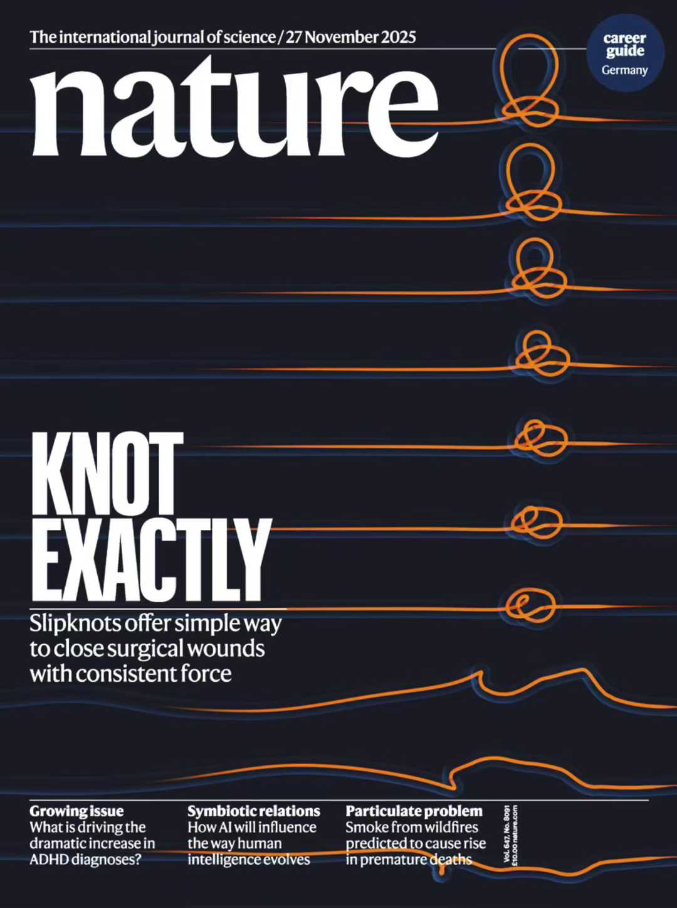
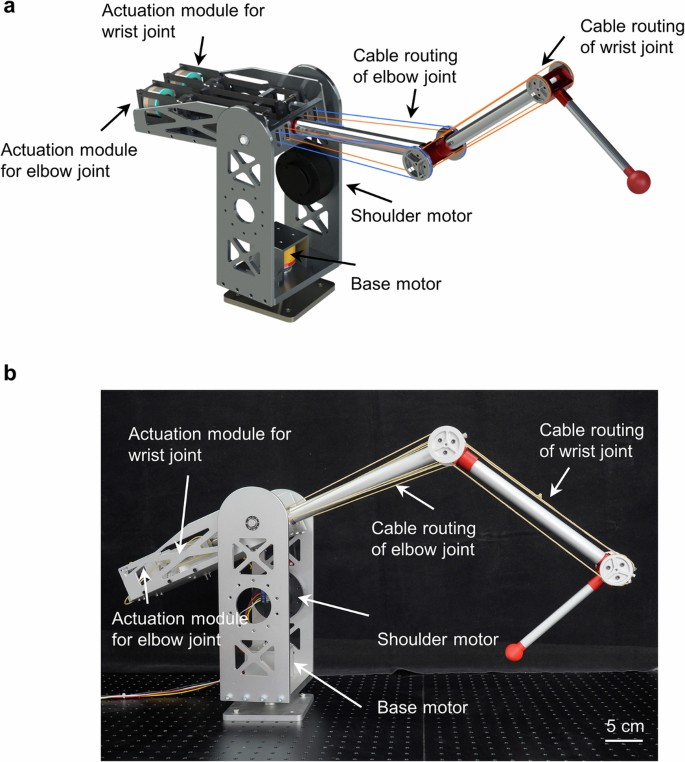

# README

This repository contains the Gyems motor driver using Linux SocketCAN for controlling the tendon‑driven robotic arm described in the cover article of Nature.

Xue, Y., Cao, J., Feng, T. et al. Slipknot‑gauged mechanical transmission and robotic operation. Nature 647, 889–896 (2025). https://doi.org/10.1038/s41586-025-09673-w

<table align="center">
  <tr>
    <td align="center"></td>
    <td align="center"></td>
  </tr>
  <tr>
    <td align="center"><b>Cover image</b></td>
    <td align="center"><b>Tendon driven robotic arm</b></td>
  </tr>
</table>

## Usage

1. Initialize the SocketCAN interface:
   - Open a terminal in the project folder and run:
     sudo ./can_init.sh
   - Verify the interface with:
     ifconfig
   - Confirm that `can0` is available.

2. Modify control code as needed:
   - You generally do not need to change `main.cpp` unless your motors are not on `can0`.
   - Edit `Controller_test.cpp` to issue motor commands. For example, use:
     pack_position_6_cmd(can_node_ID, incremental_angle_in_0.01_deg, max_speed_deg_per_sec)
   - Use this to move motors to desired positions.

3. Build the project:
   - Go to the `test_motors/` folder and create a build directory:
     mkdir build
     cd build
     cmake ..
     make

4. Run:
   - From the build directory run:
     sudo ./main
   - Press Ctrl+C to stop motors.

## Folder structure

- modules: libraries used by projects
- test*: project folders that may contain different versions

Each project has an independent CMakeLists.txt and can be built separately. This structure allows multiple versions of the same module and independent projects.

## Notes

- Running with real‑time threads or accessing CAN devices may require `sudo`.
- Ensure you understand motor and safety procedures before operating the hardware.
